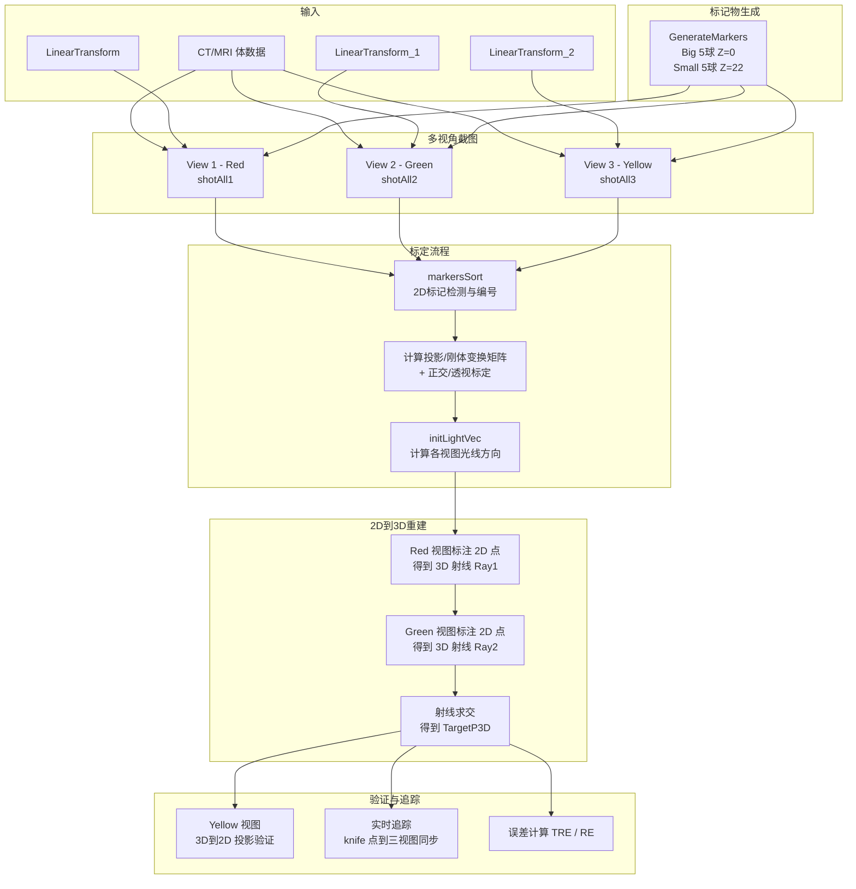
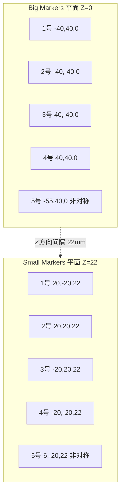
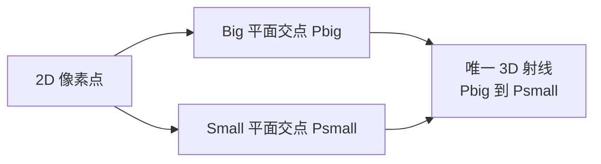
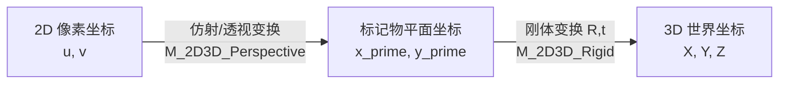
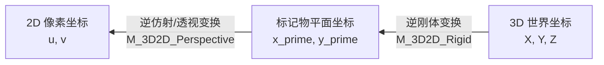
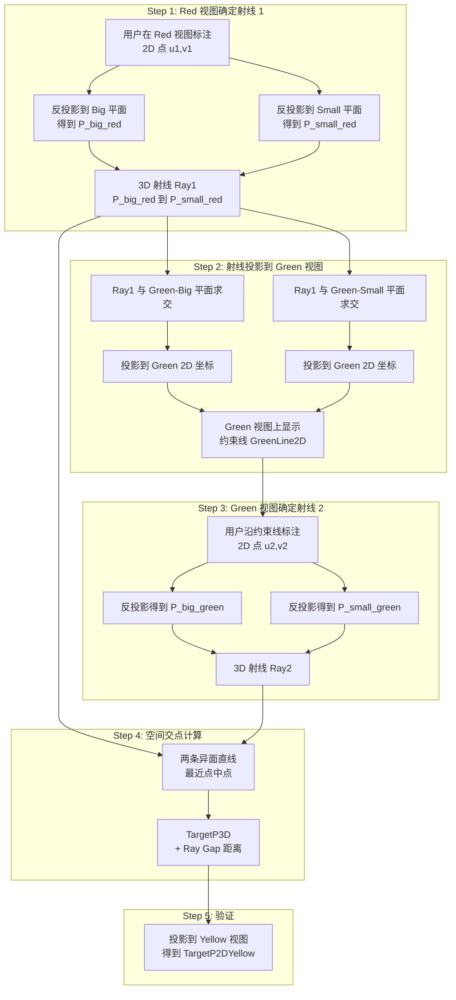
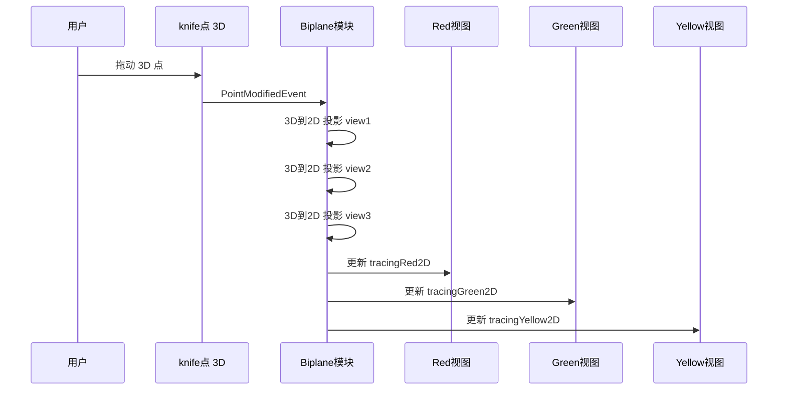
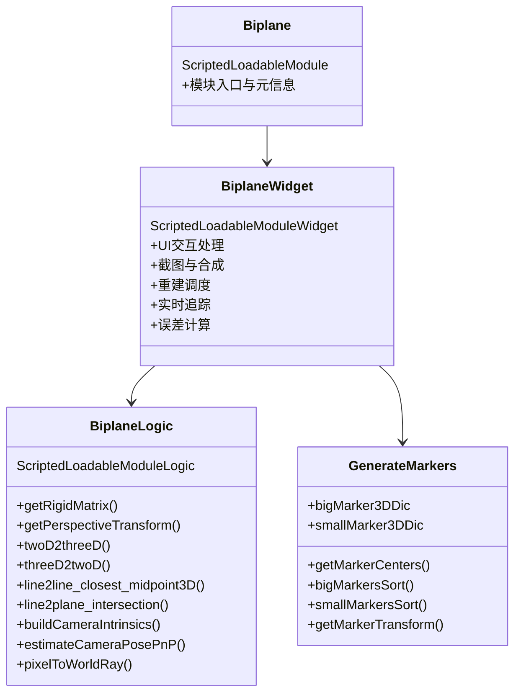
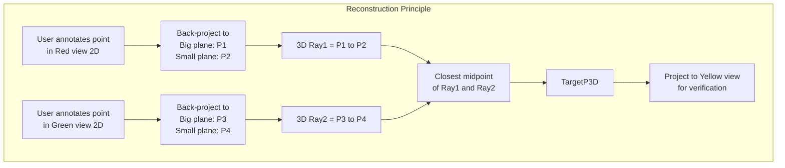

# Biplane

基于双平面标记的 2D-3D 重建模块

[中文](#中文) | [English](#english)

---

## 中文

### 简介

**Biplane** 是一个 [3D Slicer](https://www.slicer.org/) 脚本化可加载模块（Scripted Loadable Module）。它通过在三维空间中放置**双层球形标记物（Big / Small markers）**作为已知参照，利用从不同角度获取的多幅 2D 投影图像，完成以下核心任务：

1. **2D 到 3D 重建**：从两个视图（Red 和 Green）上标注的 2D 点反推出 3D 空间中的目标点。
2. **3D 到 2D 投影验证**：将重建得到的 3D 点投影到第三个视图（Yellow），用于视觉验证。
3. **实时追踪（Tracing）**：在 3D 空间中拖动标记点时，自动将其投影到三个 2D 视图上同步显示。

> 本仓库包含 `Testing/` 下的示例数据（`.mrml` / `.nrrd` / `.h5` 等），可在 Slicer 中快速打开场景进行验证。

---

### 系统总体架构



---

### 核心原理

#### 1. 双层标记物体系

系统使用两组共 **10 个球形标记物**，分布在两个平行平面上：

| 层级 | 数量 | 半径 | Z 坐标 | 用途 |
|------|------|------|--------|------|
| **Big markers** | 5 | 6 mm | Z = 0 | 定义参考平面 1 |
| **Small markers** | 5 | 4 mm | Z = 22 | 定义参考平面 2 |

标记物三维分布示意：



**为什么需要两层标记物？** 这是整个系统的关键设计：

- 同一个 2D 像素点对应的 3D 射线（视线方向），必然穿过两个标记物平面。
- 通过分别在 Big 平面和 Small 平面上求得交点，就确定了 **一条唯一的 3D 射线**。
- 来自两个不同视角的两条 3D 射线在空间中相交（或最近距离中点），即为重建的 3D 目标点。

**第 5 个非对称标记物**（Big 5号 和 Small 5号）用于打破对称性，使自动编号算法能唯一确定每个标记物的标号。

双层标记物确定 3D 射线的原理：



---

#### 2. 标记物自动检测与排序


排序算法通过分析每个标记物与其他 4 个标记物之间向量的**夹角特征**来判断编号：

| 特征条件 | 判定编号 |
|----------|----------|
| 存在两个向量夹角约 180 度 | **Big 1号**（共线中点） |
| 存在两个向量夹角约 0 度且长度差大 | **Big 5号**（非对称点） |
| 存在两个向量夹角约 0 度且长度差小 | **Big 4号**（对角线延长点） |
| 剩余两点通过与已知向量比较 | **Big 2号** 和 **Big 3号** |

Small 标记物使用相同算法，仅角色映射略有不同。

---

#### 3. 坐标变换链（2D 到 3D）

每个视角的坐标映射由**两步变换**串联构成：

**2D 到 3D 路径：**



**3D 到 2D 路径（逆过程）：**



**步骤详解：**

**Step 1 — 仿射（或透视）变换：** 建立 2D 像素坐标与标记物"出厂坐标系"之间的映射。

- **正交模式**：使用 5 点最小二乘拟合 2x3 仿射矩阵

$$\begin{pmatrix} u \\ v \end{pmatrix} = \begin{pmatrix} a_{11} & a_{12} & t_x \\ a_{21} & a_{22} & t_y \end{pmatrix} \begin{pmatrix} x' \\ y' \\ 1 \end{pmatrix}$$

- **透视模式**：使用 `cv2.findHomography` 计算 3x3 单应性矩阵

**Step 2 — 刚体变换（SVD 配准）：** 将标记物出厂坐标系变换到当前 3D 世界坐标系。

使用 SVD 分解计算最优旋转 R 与平移 t：

$$H = (P_{src} - \bar{P}_{src})^T (P_{tgt} - \bar{P}_{tgt})$$

$$H = U \Sigma V^T, \quad R = V^T U^T$$

$$t = \bar{P}_{tgt} - R \cdot \bar{P}_{src}$$

---

#### 4. 投影模式标定

系统支持两种投影模式，各有独立的标定方法：

##### 正交投影模式（Orthographic）

拟合 2x4 线性投影矩阵 P：

$$\begin{pmatrix} u \\ v \end{pmatrix} = P \begin{pmatrix} X \\ Y \\ Z \\ 1 \end{pmatrix}, \quad P \in \mathbb{R}^{2 \times 4}$$

由 P 的前 3 列 A 导出视线方向：

$$\mathbf{d} = A_{\text{row1}} \times A_{\text{row2}}$$

反投影得到的世界射线为：

$$\mathbf{x}_0 = A^T(AA^T)^{-1}(\mathbf{p}_{px} - \mathbf{t}), \quad \text{方向} = \mathbf{d}$$

##### 透视投影模式（Perspective）

使用 OpenCV 的 `solvePnP` 求解相机位姿，结合内参矩阵 K：

$$K = \begin{pmatrix} f_y & 0 & c_x \\ 0 & f_y & c_y \\ 0 & 0 & 1 \end{pmatrix}, \quad f_y = \frac{h/2}{\tan(\text{FOV}/2)}$$

反投影为世界射线：

$$\mathbf{d}_{cam} = K^{-1} \begin{pmatrix} u \\ v \\ 1 \end{pmatrix}, \quad \mathbf{d}_{world} = R^T \mathbf{d}_{cam}, \quad \mathbf{o}_{world} = -R^T \mathbf{t}$$

---

#### 5. 双视图 3D 重建流程



**异面直线最近点中点算法：**

两条 3D 射线通常不会精确相交（存在测量噪声），采用如下方法求最近点对的中点：

给定 $L_1: \mathbf{p}_1 + s \cdot \mathbf{u}$ 和 $L_2: \mathbf{p}_2 + t \cdot \mathbf{v}$，令 $\mathbf{w}_0 = \mathbf{p}_1 - \mathbf{p}_2$：

$$a = \mathbf{u} \cdot \mathbf{u}, \quad b = \mathbf{u} \cdot \mathbf{v}, \quad c = \mathbf{v} \cdot \mathbf{v}, \quad d = \mathbf{u} \cdot \mathbf{w}_0, \quad e = \mathbf{v} \cdot \mathbf{w}_0$$

$$s = \frac{be - cd}{ac - b^2}, \quad t = \frac{ae - bd}{ac - b^2}$$

$$Q_1 = \mathbf{p}_1 + s \cdot \mathbf{u}, \quad Q_2 = \mathbf{p}_2 + t \cdot \mathbf{v}$$

$$\boxed{\text{TargetP3D} = \frac{Q_1 + Q_2}{2}}, \quad \text{Ray Gap} = \|Q_1 - Q_2\|$$

---

#### 6. 截图合成流程

每个视角的截图分三步完成，最终合成一幅可用于标记物检测的 2D 切片图像：


合成公式：

$$I_{\text{comp}} = I_{\text{body}} \times \frac{I_{\text{markers}} + 1000}{1000} + I_{\text{markers}}$$

$$I_{\text{final}} = I_{\text{comp}} \times \frac{I_{\text{testpoint}} + 100}{100} + I_{\text{testpoint}}$$

这使得 **markers 区域** 像素值为 **-1000**，**testPoint 区域** 像素值为 **-100**，可被后续二值化阈值分割准确提取。

---

#### 7. 实时追踪（Tracing）



---

### 文件结构

```
Biplane/
├── Biplane.py              # 主模块：UI 交互、截图、重建流程
├── BiplaneLogics.py        # 逻辑层：变换计算、几何运算、标记物生成
├── CMakeLists.txt           # Slicer 扩展构建配置
├── README.md
├── Resources/
│   ├── Icons/               # 模块图标
│   └── UI/
│       └── Biplane.ui       # Qt Designer UI 布局
└── Testing/
    ├── BIPLANE/             # 测试场景数据
    ├── BISlicer/
    │   └── markers.vtk      # 标记物 VTK 数据
    └── Python/              # Python 测试用例
```

**核心类关系：**



---

### 运行环境

| 依赖 | 说明 |
|------|------|
| **3D Slicer** | 建议 5.2 以上稳定版 |
| `vtk` | Slicer 自带 |
| `numpy` | Slicer 自带 |
| `SimpleITK` | 图像处理与标记物检测 |
| `OpenCV cv2` | 透视变换 / PnP 求解（模块自动安装） |
| `ScreenCapture` | Slicer 内置截图模块 |

### 安装方式

1. 打开 3D Slicer
2. 将本仓库作为扩展模块加载（二选一）：
   - **方式 A**：将整个文件夹路径添加到 Slicer - Edit - Application Settings - Modules - Additional module paths
   - **方式 B**：用 CMake 构建 Slicer 扩展（本仓库带有 `CMakeLists.txt`）

### 快速上手


**详细步骤：**

1. 打开示例场景 `Testing/BISlicer/` 或加载你自己的 CT/MRI 数据
2. 在模块 UI 的 **Input volume** 选择体数据
3. 点击 `showVolume`（可选）启用体渲染
4. 点击 `showMarker` 生成 markers 模型
5. 通过 **Transforms** 模块调整 `LinearTransform` / `LinearTransform_1` / `LinearTransform_2` 来旋转标记物到三个不同视角
6. 依次对三个视角点击 `shotAll1` / `shotAll2` / `shotAll3`，一键完成截图与 2D 切片生成
7. 点击 `markersSort`：自动检测、编号标记物并计算所有坐标变换矩阵
8. 在 Red 视图放置 2D 点，选择到 `Red 2D Point`，点击 `redPush`（Green 视图出现 **约束线**）
9. 在 Green 视图沿约束线放置 2D 点，选择到 `Green 2D Point`，点击 `greenPush`
   - 自动计算 3D 交点 `TargetP3D` 并显示在 3D 视图
   - 自动在 Yellow 视图显示验证点 `TargetP2DYellow`
10. （可选）**实时追踪**：选择 `knife` 点，点击 `real time tracing`，拖动 3D 点即可在三视图同步显示投影

### 输出与文件格式

截图与中间文件默认输出到 Slicer 临时目录下的 `Biplane/` 文件夹。

| 文件名 | 内容 | 像素值约定 |
|--------|------|-----------|
| `shotXBody.png` | 仅体数据截图 | 原始灰度 |
| `shotXMarkers.png` | 仅标记物截图 | - |
| `shotXTestPoint.png` | 仅测试点截图 | - |
| `shotX.nii.gz` | 合成切片 | markers: **-1000** / testPoint: **-100** |

### 误差指标

| 指标 | 含义 | 计算方法 |
|------|------|---------|
| **TRE** mm | 目标配准误差 | 两个 3D 点的欧氏距离 |
| **RE** px | 重投影误差 | 两个 2D 点的像素平面欧氏距离 |
| **Ray Gap** mm | 射线间隙 | 两条 3D 射线的最近距离 |

---

## English

### Overview

**Biplane** is a [3D Slicer](https://www.slicer.org/) Scripted Loadable Module that reconstructs 3D target points from 2D annotations across multiple views (Red / Green / Yellow), using a **dual-layer spherical marker system** as a calibration reference.

Core capabilities:

1. **2D to 3D Reconstruction**: Determine a 3D target point from two 2D annotations via ray intersection.
2. **3D to 2D Projection Verification**: Project the reconstructed 3D point onto a third view for visual validation.
3. **Real-time Tracing**: Synchronize projections in all three 2D views when a 3D point is moved interactively.

> Sample data for quick validation is included under `Testing/`.

### Key Principle

The system places **10 spherical markers** on two parallel planes at different Z heights (Big at Z=0, Small at Z=22). For each view, the known 3D marker geometry enables computing a mapping between 2D pixel coordinates and 3D world coordinates.

A 2D pixel point is back-projected onto **both marker planes**, producing two 3D points that define a unique **3D ray** (line of sight). Rays from two different views are intersected in 3D space — their closest midpoint yields the reconstructed target point.



### Projection Modes

| Mode | Calibration Method | Back-projection |
|------|-------------------|-----------------|
| **Orthographic** | Least-squares 2x4 linear projection matrix | Pseudo-inverse + cross-product direction |
| **Perspective** | OpenCV solvePnP with camera intrinsics | K-inverse pixel ray rotated by R-transpose |

### Requirements

- 3D Slicer (5.2 or above recommended)
- Python environment provided by Slicer (vtk, numpy, SimpleITK, OpenCV)

### Install

1. Open 3D Slicer
2. Add this repository folder to **Edit - Application Settings - Modules - Additional module paths**, or build as a Slicer extension via CMake.

### Quick Start

1. Load your CT/MRI data or open a sample scene from `Testing/`
2. Select the input volume, click `showMarker`
3. Adjust three different view angles via `LinearTransform` nodes
4. Click `shotAll1` / `shotAll2` / `shotAll3` for each view
5. Click `markersSort` to calibrate
6. Annotate in Red view, click `redPush`, then annotate in Green view, click `greenPush`
7. View reconstructed 3D point and Yellow-view verification

### Outputs

| File | Content | Pixel Convention |
|------|---------|------------------|
| `shotXBody.png` | Body only | Original grayscale |
| `shotXMarkers.png` | Markers only | - |
| `shotXTestPoint.png` | Test point only | - |
| `shotX.nii.gz` | Composite slice | markers: **-1000** / testPoint: **-100** |

### Error Metrics

| Metric | Description |
|--------|-------------|
| **TRE** mm | Euclidean distance between two 3D points |
| **RE** px | Euclidean distance between two 2D points |
| **Ray Gap** mm | Closest distance between two 3D rays |
