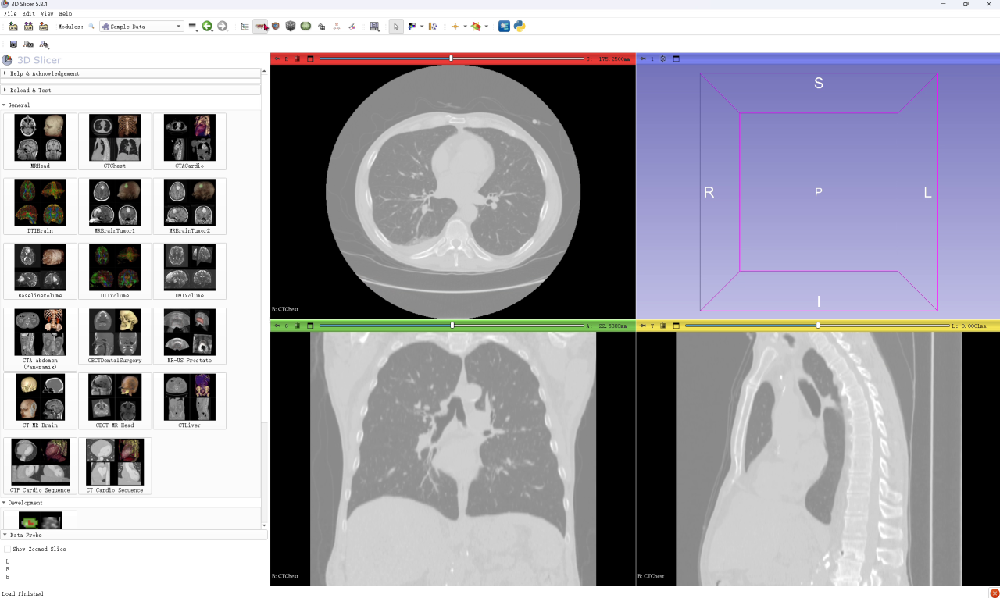
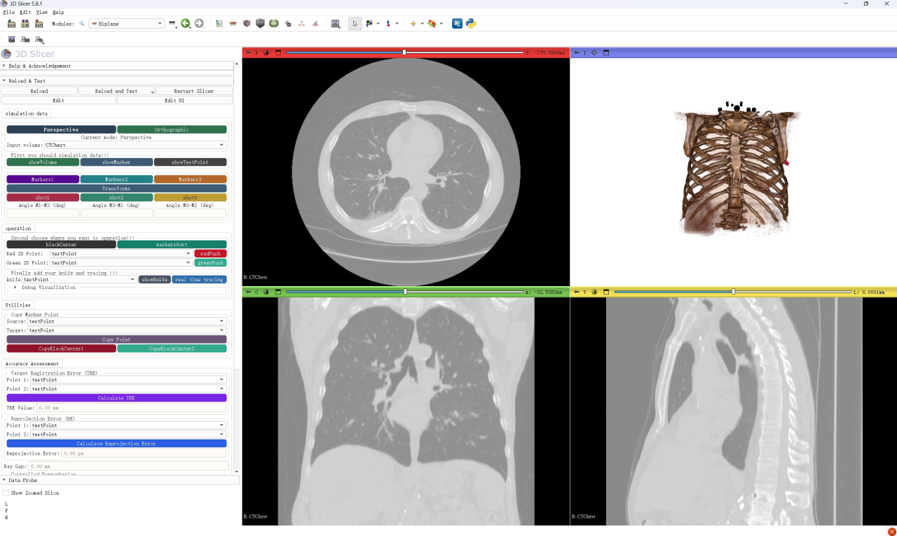
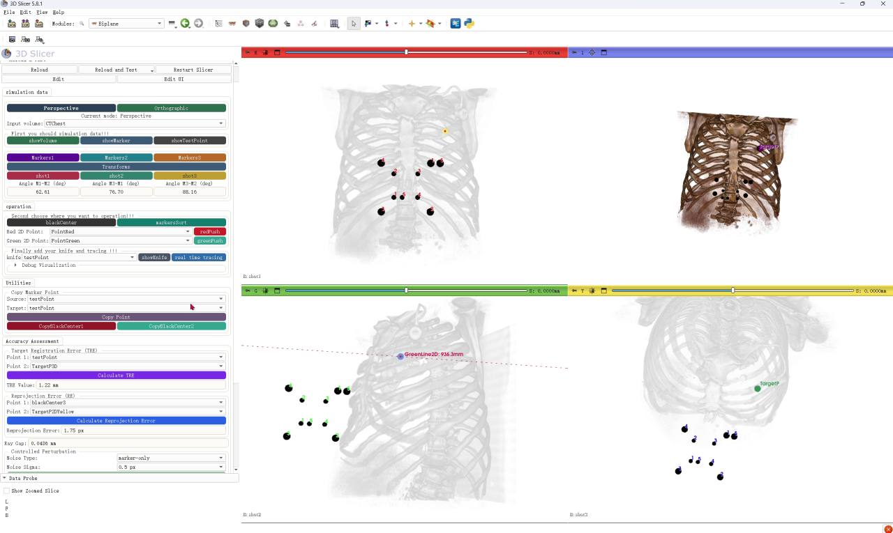

# Biplane：基于双平面 Fiducial 结构的多视角目标定位

[English](README.md) | [论文：待补充] | [演示视频](#演示视频)

本仓库为以下论文的研究源码：

> Multiview Target Localization and Navigation Using a Biplanar Fiducial Structure: A Decoupled Validation Study

论文目前仍处于准备/评审阶段。论文链接与正式引用信息将在发表后补充。

<p align="center">
  
</p>

Biplane 是一个 3D Slicer Scripted Module，用于基于已知双平面 fiducial 结构的多视角目标定位与导航显示验证。模块通过 2D-3D marker 对应关系标定投影几何，从两个 2D 观测恢复 3D 目标点，并将该目标点前向投影到独立第三视图中进行验证。

## 最新状态

- 2026 年 5 月：仓库整理为论文评审阶段源码。
- 已测试版本：3D Slicer 5.8.1。

## 安装

### 运行环境

- 3D Slicer 5.8.1。
- Windows 操作系统已验证。macOS 与 Linux 尚未测试，但理论上只要能够正常运行 3D Slicer 及所需 Python 依赖，应可运行本模块。
- 无特殊硬件要求，能够正常运行 3D Slicer 即可。

由于 3D Slicer 不同版本之间 API 与界面行为可能变化，更新版本可能需要少量适配。

模块运行在 Slicer 自带的 Python 环境中。`SimpleITK` 与 `opencv-python` 会通过模块内的依赖辅助代码导入；如果缺失，模块会尝试自动安装到 Slicer 环境中。若自动安装因网络或代理限制失败，可在 Slicer Python 环境中手动安装。

### 加载模块

```bash
git clone https://github.com/CodingHHW/Biplane.git
```

然后打开 3D Slicer：

1. 进入 `Edit -> Application Settings -> Modules`。
2. 将本仓库根目录加入 `Additional module paths`。
3. 重启 3D Slicer。
4. 打开 `Biplane` 模块。

当前模块可能仍显示在 `Examples` 分类下。

## 快速开始

### 基本流程

1. 加载示例体数据，并在 `Input volume` 中选择该 volume。
2. 选择 `Perspective` 或 `Orthographic`。
3. 点击 `showVolume`、`showMarker` 与 `showTestPoint`。
4. 设置或确认 `Markers1`、`Markers2` 与 `Markers3`。
5. 依次点击 `shot1`、`shot2` 与 `shot3` 采集三个视图。
6. 点击 `markersSort`。
7. 在 Red 视图中选择目标点并点击 `redPush`。
8. 在 Green 视图中确认对应点并点击 `greenPush`。
9. 查看 `TargetP3D` 与 `TargetP2DYellow`。
10. 可选：计算 `TRE`、`Reprojection Error` 与 `Ray Gap`。
11. 点击 `Export Current Results to CSV`。

### 输出

- 中间截图与体数据：`<Slicer temporaryPath>/Biplane/`
- 实验 CSV：`experiment/experiment_results.csv`
- transform 快照：`experiment/transform_snapshots/<experiment_record_id>/`

## 演示视频

录制的演示视频已上传至 YouTube，以便在网页中稳定播放。仓库仅在 `demo_videos/` 中保留本地预览图。

<p align="center">
  <strong>视频 1：无测量误差的目标定位与导航显示流程</strong><br>
  <a href="https://www.youtube.com/watch?v=6F34s5bbvA0">
    
  </a><br>
  <a href="https://www.youtube.com/watch?v=6F34s5bbvA0">在 YouTube 观看</a>
</p>

<p align="center">
  <strong>视频 2：TRE 与 RE 误差计算流程</strong><br>
  <a href="https://www.youtube.com/watch?v=b19Zt3hKDdA">
    
  </a><br>
  <a href="https://www.youtube.com/watch?v=b19Zt3hKDdA">在 YouTube 观看</a>
</p>

<p align="center">
  <strong>视频 3：噪声扰动下 TRE 与 RE 的变化</strong><br>
  <a href="https://www.youtube.com/watch?v=QhqlMMyc5a8">
    
  </a><br>
  <a href="https://www.youtube.com/watch?v=QhqlMMyc5a8">在 YouTube 观看</a>
</p>

## 示例与分析

仓库包含论文准备阶段使用的实验记录与分析文件：

- `experiment/experiment_results.csv`
- `Analysis/experiment_results_analysis.ipynb`
- `Analysis/projection_workflow_analysis.py`
- `Analysis/figures/experiment_results_analysis/`
- `Analysis/tables/experiment_results_analysis/`

打开分析 notebook：

```bash
python -m venv .venv
.venv\Scripts\activate
python -m pip install -r requirements.txt
jupyter notebook Analysis/experiment_results_analysis.ipynb
```

## 数据与资源

示例测试资源位于 `Testing/`。实验日志与 transform 快照位于 `experiment/`。

如果某些文件不能公开再分发，应移至外部归档或 release asset，并在此处提供链接。

## 开发说明

- Slicer 模块主文件：`Biplane.py`
- 几何计算逻辑：`BiplaneLogics.py`
- UI 资源：`Resources/`
- 论文图与草稿：`manuscript/`

## 许可证

源码以 MIT License 开源，详见 `LICENSE`。

数据集与第三方资源可能需要单独的许可证说明。

## 引用 Biplane

如果你使用本仓库，请引用相关论文与本软件仓库。

当前可通过 `CITATION.cff` 生成软件引用。论文发表后将补充最终 BibTeX。
